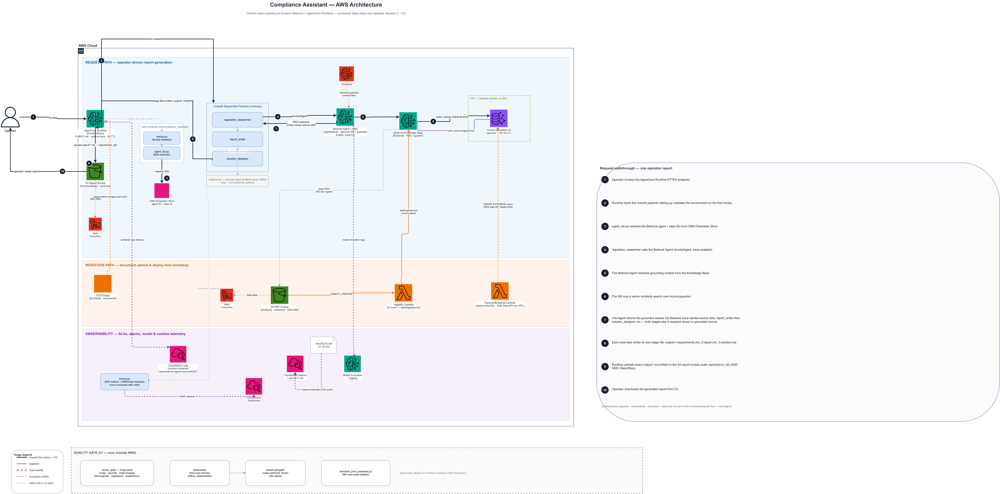

# Compliance Assistant - production-hardened reference sample

A CrewAI + Amazon Bedrock compliance-research assistant that turns a regulation
topic into a cited report. The project started as an AWS sample and was
production-hardened against the
[AWS Well-Architected GenAI Lens](https://docs.aws.amazon.com/wellarchitected/latest/generative-ai-lens/generative-ai-lens.html)
across six workstreams: IaC, config hardening, RAG evals, runtime IaC,
observability, and a final evidence-backed audit. For the engineering
narrative, see [ARCHITECTURE.md](ARCHITECTURE.md). For the WA-Lens audit
itself, see
[docs/analysis/2026-05-16-compliance-prod-readiness.md](docs/analysis/2026-05-16-compliance-prod-readiness.md).

## Architecture



Architecture source:
[`docs/diagrams/compliance-assistant-v12.drawio`](docs/diagrams/compliance-assistant-v12.drawio).
The numbered steps trace one operator request; the same flow is narrated in
[`docs/SYSTEM.md`](docs/SYSTEM.md). The diagram's review history is in
[`docs/diagrams/compliance-assistant-review-log.md`](docs/diagrams/compliance-assistant-review-log.md).

## Current status

The repo is **verified in code and tests, not yet proven in production**.
The local and CI path now covers synth, pytest, the offline eval gate,
cfn-lint, runtime durability, ingest failure handling, and alarm wiring. The
billable `cdk deploy` remains an explicit operator step because the deployed
stack runs Aurora pgvector, Bedrock Agent, KB ingestion, and AgentCore
Runtime - all of which carry real cost.

| Layer | What ships | Verified by |
|------|------------|-------------|
| Bedrock knowledge layer | CDK synth -> 5 templates | [`infra/stacks/kb_stack.py`](infra/stacks/kb_stack.py), [`infra/stacks/agent_stack.py`](infra/stacks/agent_stack.py), [`infra/tests/`](infra/tests/) |
| Config and secrets | Fail-fast startup validation; env-gated verbosity | [`src/compliance_assistant/startup.py`](src/compliance_assistant/startup.py), [`tests/test_startup.py`](tests/test_startup.py) |
| RAG evaluation harness | Offline gate plus post-deploy live conformance subset | [`tests/evals/`](tests/evals/), `pytest tests/evals -m gate`, `python -m tests.evals.harness.live_agent` |
| AgentCore Runtime IaC | Runtime + ECR stacks, durable run manifests, async shim | [`infra/stacks/runtime_stack.py`](infra/stacks/runtime_stack.py), [`infra/runtime/server.py`](infra/runtime/server.py), [`infra/tests/test_runtime_server.py`](infra/tests/test_runtime_server.py) |
| Observability and alarms | EMF tracing, redaction, SLO alarms, SNS notification path | [`src/compliance_assistant/tracing.py`](src/compliance_assistant/tracing.py), [`docs/SLOs.md`](docs/SLOs.md), [`infra/stacks/observability_stack.py`](infra/stacks/observability_stack.py) |
| WA-Lens audit | All 7 pillars, evidence-backed findings | [`docs/analysis/2026-05-16-compliance-prod-readiness.md`](docs/analysis/2026-05-16-compliance-prod-readiness.md) |
| Quality gate | 6-leg review panel with mutation and coverage floors | [`review_gate/`](review_gate/), [`tests/review_gate/`](tests/review_gate/) |

**What is not yet proven here:** a first hardened-stack deploy, one grounded
end-to-end run, one correct not-found run, one passing live conformance run,
and one confirmed `ComplianceAssistant/Crew` CloudWatch metric receipt. Until
those are captured, the honest claim is "verified in code and tests, not yet
proven in production."

## Quick start

Requires Python 3.10+ and Node.

```bash
pip install uv
uv sync
uv sync --extra infra
uv sync --extra gate

cd infra
npx aws-cdk@latest synth ComplianceObservabilityStack ComplianceKbStack ComplianceAgentStack ComplianceRuntimeEcrStack ComplianceRuntimeStack -q
cd ..

PYTHONPATH=src python -m pytest tests infra/tests -q
PYTHONPATH=src python -m pytest tests/evals -m gate -q
```

GitHub Actions runs the same core checks on push and pull request via
`.github/workflows/ci.yml`.

To enforce the quality gate locally before commit and push:

```bash
powershell -ExecutionPolicy Bypass -File scripts/install-git-hooks.ps1
```

The repo-scoped hooks verify the locked dependency graph with `uv sync
--frozen`, run `pytest`, run the offline eval gate, synth the CDK stacks, and
run `cfn-lint`. If you want stricter local static analysis, set
`ENABLE_BANDIT_HOOK=1` to require Bandit and `ENABLE_SONAR_HOOK=1` to require
`sonar-scanner` plus `sonar-project.properties`.

## Engineering posture

- Synth + test is deliberately separate from deploy. The operator-gated deploy
  path exists because real AWS resources cost money and mutate account state.
- The 6-leg quality gate is part of the system, not a replacement for CI.
  `review_gate/` made the multi-phase autonomous work credible; GitHub Actions
  now enforces the existing pytest + offline eval + cfn-lint checks.
- The repo still tells the truth about deployment status. The code paths are
  hardened; the first live proof run still has to happen.

## Repository layout

```text
infra/              CDK stacks (kb, agent, runtime, ecr, observability)
infra/tests/        Synth-time and unit tests for the infra path
src/compliance_assistant/
                    Crew, tracing, startup validation, citations
tests/              Top-level Python tests
tests/evals/        Offline eval gate and live conformance harness
tests/review_gate/  Tests for the quality-gate machine
review_gate/        Quality-gate orchestration
docs/               Tracked product, architecture, eval, SLO, and audit docs
analysis/_legacy/   Pre-hardening sample artifacts
```

## Configuring and running the crew

The crew is a sequential pipeline (researcher -> writer -> designer) that
delegates retrieval to a Bedrock Agent. Configuration is read from `.env` with
fail-fast validation. After deploy, the Bedrock Agent IDs are published to SSM
and read at startup; you do not copy deployed IDs into `.env` manually. See
[`.env.example`](.env.example) for the contract.

To run the crew against a deployed stack:

```bash
crewai run
```

The crew writes to `output/1-requirements.md`, `output/2-report.md`, and
`output/3-solution.md`. The standalone `## Sources` renderer in
`citations.py` is an eval utility, not part of the runtime report path.

## Documentation

| File | Purpose |
|---|---|
| [`docs/SYSTEM.md`](docs/SYSTEM.md) | System guide and flow narrative |
| [`ARCHITECTURE.md`](ARCHITECTURE.md) | Engineering deep dive |
| [`docs/threat-model.md`](docs/threat-model.md) | Trust boundaries and residual risks |
| [`docs/live-launch.md`](docs/live-launch.md) | Operator launch proof protocol |
| [`docs/evals.md`](docs/evals.md) | Offline eval gate plus live conformance contract |
| [`docs/SLOs.md`](docs/SLOs.md) | SLO table parsed into CloudWatch alarms |
| [`docs/analysis/2026-05-16-compliance-prod-readiness.md`](docs/analysis/2026-05-16-compliance-prod-readiness.md) | Evidence-backed WA-Lens audit |
| [`docs/adr/`](docs/adr/) | Architecture Decision Records |

## License

MIT-0. See [LICENSE](LICENSE).
