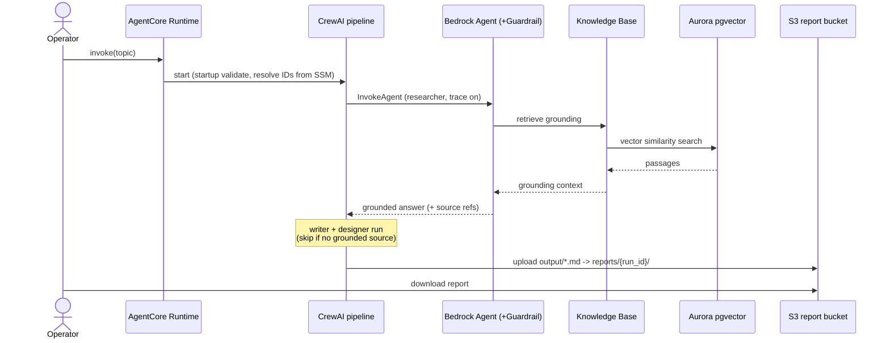

# System guide — Compliance Assistant

How the system behaves end to end: who uses it, what they ask of it, and the
two flows that matter (generating a report, and getting regulatory documents
into the knowledge base). For the infrastructure rationale see
[`../ARCHITECTURE.md`](../ARCHITECTURE.md); for the visual map see
[`diagrams/compliance-assistant-v12.png`](diagrams/compliance-assistant-v12.png).

## Personas

- **Compliance operator (primary).** Wants a cited, grounded report on a
  regulation topic (e.g. "latest PCI DSS requirements for trading platforms")
  for a financial-services organization — and needs to trust that every stated
  requirement traces to a retrieved source, not to model guesswork.
- **Platform engineer.** Deploys and operates the stack: synthesizes the IaC,
  runs the eval gate, owns the operator-gated `cdk deploy`, and watches the
  SLO-anchored alarms.

## User stories

- *As an operator,* I describe a regulation topic and receive a report whose
  every requirement carries an inline source reference.
- *As an operator,* when the knowledge base does not cover a point, I want the
  system to say "not found in knowledge base" rather than invent a requirement
  (see [ADR 0005](adr/0005-conditional-report-stages.md)).
- *As a platform engineer,* I want the CloudWatch alarms to track the documented
  SLOs ([`SLOs.md`](SLOs.md), [ADR 0006](adr/0006-slos-md-single-source.md)) and
  the eval gate to block retrieval/generation regressions before any deploy
  ([`evals.md`](evals.md)).

## Flow 1 — Generating a report (the numbered request path)

These ten steps match the numbered walkthrough on the architecture diagram.

1. The operator invokes the AgentCore Runtime HTTPS endpoint with a topic.
2. The runtime starts the CrewAI pipeline; `startup.py` fail-fast-validates the
   environment on first invoke.
3. `agent_ids.py` resolves the Bedrock agent + alias IDs from SSM Parameter
   Store ([ADR 0003](adr/0003-agent-ids-via-ssm-not-env.md)).
4. `regulation_researcher` calls the Bedrock Agent (`InvokeAgent`, trace on).
5. The Bedrock Agent retrieves grounding context from the Knowledge Base.
6. The Knowledge Base runs a vector similarity search over Aurora pgvector
   ([ADR 0001](adr/0001-aurora-pgvector-over-opensearch.md)).
7. The agent returns the grounded answer (its trace carries source references).
   `report_writer`, then `solution_designer`, run — both stages **skip** if the
   research found no grounded source.
8. Each crew task writes its stage file: `output/1-requirements.md`,
   `output/2-report.md`, `output/3-solution.md`.
9. The runtime uploads every `output/*.md` artifact to the S3 report bucket
   under `reports/{run_id}/` (SSE-KMS, versioned).
10. The operator downloads the generated report from S3.

## Flow 2 — Getting documents into the knowledge base (ingestion)

1. A maintainer uploads a regulatory PDF to the S3 corpus bucket (versioned,
   SSE-KMS, public access blocked).
2. The `OBJECT_CREATED` event triggers the IngestFn Lambda, which calls
   `StartIngestionJob` (a control-plane call).
3. The Knowledge Base ingests: it reads the PDFs, chunks them with the
   eval-selected chunking config, embeds the chunks, and writes vectors to
   Aurora pgvector.
4. (Deploy-time, once.) A bootstrap Lambda creates the `vector` extension and
   schema in Aurora via the RDS Data API, outside the VPC.

The chunking configuration is not a guess — it is the winner the eval harness
selected and recorded ([`evals.md`](evals.md)).

## What the system does not do

Read-and-report only: no booking or other state-changing actions, and no
storage of end-user PII. Trust boundaries and residual risks are in
[`threat-model.md`](threat-model.md).
